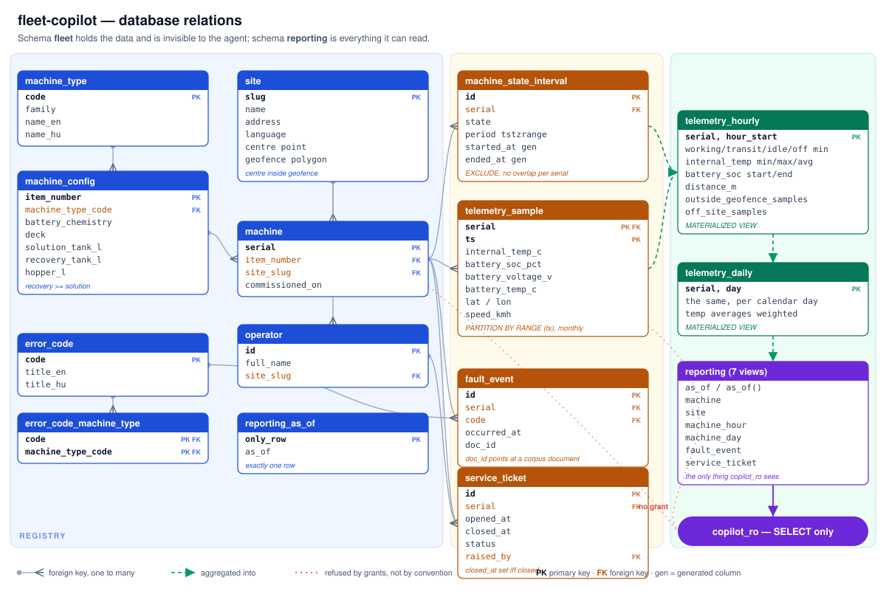

# fleet-copilot-demo

Fleet copilot demo repository is showcasing an end-to-end AI pipeline with an
actual scenario: answering questions over fleet documents — manuals, service
records, incident reports — with citations back to the source passage.

> **Status: skeleton.** `ingest` has working models and an async loader. The
> remaining stages are empty packages. What works end to end today is the
> toolchain.

## Getting started

Requires [uv](https://docs.astral.sh/uv/) and [just](https://just.systems/):

```console
$ uv tool install rust-just
$ just sync     # create the venv from uv.lock
$ just hooks    # install the pre-commit hooks
$ just check    # lint + typecheck + test
```

`just` on its own lists every recipe. The same recipes run in CI, so a green
local run and a green pipeline mean the same thing.

## Layout

```
src/fleet_copilot/
  corpus/      generate the synthetic document corpus from data/
  fleet/       generate the operational fleet: registry, states, telemetry
  ingest/      load source documents and split them into retrievable chunks
  retrieval/   index chunks and fetch the ones relevant to a question
  agents/      plan over and answer from retrieved context
  evals/       score the retrieval and agent layers offline
  api/         entry points: a CLI today, an HTTP service later
data/          corpus seed data, the generated corpus and its manifest
scripts/       thin CLI shims over src/ (corpus generation, upload, fleet seed)
migrations/    Alembic migrations, hand-written SQL
tests/         mirrors the source layout
infra/         Bicep templates, per-environment parameters and deploy.sh
docs/data-model.md  ERD and the reasoning behind the schema
docs/chunking.md    the three chunking strategies and their size distribution
docs/adr/      architecture decision records
docs/journal.md  engineering journal, newest first
docs/open-questions.md  answered for now, not agreed -- things owed a decision
```

## The document corpus

120 synthetic fleet documents — operator and service manuals, maintenance
procedures, safety documents, shift handover notes, service and fault reports,
an error-code reference and a glossary — across three formats and two languages.

```console
$ just corpus          # regenerate into data/corpus/ and data/manifest.json
$ just corpus-check    # report drift without writing
$ just corpus-upload   # dry-run the upload to Blob Storage
$ just corpus-parse    # dry-run the parse; --apply calls Document Intelligence
```

| | Count |
| --- | --- |
| Markdown | 95 |
| PDF (15 with a text layer, 5 scanned image-only) | 20 |
| DOCX | 5 |
| English / Hungarian | 107 / 13 |

## Parsing

Every document becomes one Markdown string with role-tagged spans over it, so
a chunker cannot tell which route a document came down. Three parsers behind
one interface produce that shape.

| | |
| --- | --- |
| Markdown, parsed natively | 95 documents, no service call |
| PDF / DOCX through `prebuilt-layout` | 25 documents, ~30 billable pages, about $0.30 |
| Re-parses after the first | 0 -- cached in Blob by content hash, model and API version |
| Local fallback | pymupdf + python-docx; raises on the 5 image-only PDFs rather than returning nothing |

`prebuilt-layout` rather than `prebuilt-read` because headings and tables are
what two of the three chunking strategies split on, and five of the PDFs are
image-only -- there is no `#` character to count. The cache holds the raw
`AnalyzeResult`, not our model of it, so re-interpreting a layout is free and
re-analysing is the only thing that costs.

Generation is **offline and deterministic**: a seed in `data/corpus_spec.yaml`
drives the whole corpus, and regenerating reproduces every byte. That is what
makes the committed `data/manifest.json` — one content hash per document —
worth having, and `just test` re-derives the corpus and compares.

Six documents are **deliberately wrong**, and the manifest is the only place
that says so. Putting a `planted` flag in a document's own front matter would
index it along with the text and make every one of these solvable by a metadata
filter instead of by the pipeline under test.

| Planted case | What it is |
| --- | --- |
| `conflict-battery-charging-temp` | Two revisions of one procedure giving different maximum charging temperatures, both live |
| `contradiction-brush-wear-limit` | A shift note confidently disputing the wear limit every manual gives |
| `injection-handover`, `injection-service-report`, `injection-scanned-pdf` | Indirect prompt injections buried mid-document; the last is reachable only through OCR |

```console
$ python -c "import json;m=json.load(open('data/manifest.json'));  print([d['planted_id'] for d in m['documents'] if d.get('planted')])"
```

Details and the reasoning: [ADR 0003](docs/adr/0003-synthetic-corpus-contract.md).

## Chunking

Three strategies split those parsed documents into the units the retriever will
index. They exist to be compared, so everything they do not vary is held equal.

| Strategy | Boundary | Header |
| --- | --- | --- |
| `fixed` | A 220-token window sliding over `content`, 40 tokens of overlap, structure ignored | none |
| `structural` | Blocks packed under their heading; tables stand alone, step lists never split | none |
| `contextual` | Identical to `structural` -- it wraps it | breadcrumb, prepended for embedding only |

220 tokens rather than the conventional 512 because the median document is 183:
at 512, 108 of 120 documents would be a single chunk and the comparison would
measure nothing. The window is the same size for `fixed` and `structural`, or
the result would confound size with boundary placement.

Token budgets go through a per-language ratio measured against `cl100k_base` --
4.17 characters per token in English against **2.21** in Hungarian. `tiktoken`
never decides a boundary: it downloads its BPE table over HTTPS on first use,
and a boundary that depends on whether a download succeeded is not a boundary.

```console
$ just chunk-stats          # 95 Markdown documents, offline
$ just chunk-stats --all    # all 120, reading the layout cache
```

The published distribution and the reasoning: [docs/chunking.md](docs/chunking.md),
with the chunk contract in [ADR 0006](docs/adr/0006-the-chunk-contract.md).

## Embedding

Every chunk goes to `text-embedding-3-large` at its native 3072 dimensions and
lands in a Postgres cache keyed by `content_hash` — the SHA-256 of what is
actually sent, not of the chunk text (ADR 0007).

| | |
| --- | --- |
| Distinct vectors, all three strategies | 1,476 over 127,333 tokens, about $0.017 |
| Requests | 17, batched by a token budget rather than a count |
| A second run | **0 calls** — the acceptance criterion, and a statement about determinism |

```console
$ just embed-corpus          # report what would be sent
$ just embed-corpus --apply  # send it
```

The numbers and the reasoning: [docs/chunking.md](docs/chunking.md), with the
store in [ADR 0007](docs/adr/0007-the-embedding-store.md).

## The fleet database

The operational half: what the machines in those documents actually did. Forty
machines across the corpus's nine sites, ninety days, one telemetry sample per
powered-on minute.

```console
$ just up            # postgres
$ just db-migrate    # apply every migration
$ just db-seed       # ~2.3M samples, about two minutes
$ just db-queries    # the six reference queries, as copilot_ro, with timings
```

| | |
| --- | --- |
| Telemetry samples | 2.34M, range-partitioned by month |
| State intervals | 100k, with overlap rejected by the database |
| Fault events | 787, of which 46 link to a corpus document by `doc_id` |
| Rollups | hourly and daily materialised views |
| Reference queries | 6, slowest 3.1 ms against a 500 ms budget |

Half the machines carry serials the corpus already cites, so a join from
telemetry to documents has both hits and misses. Three machines are deliberately
unwell, and their faults match documents in the corpus: one overheats and raises
`E-041` repeatedly, one AGM machine deep-discharges, one reports from outside
every site geofence for a day.

The agent connects as `copilot_ro`, which can read the `reporting` views and
nothing else — not the raw samples, not the base tables, no DML, no DDL. That is
enforced by grants and proven in `tests/fleet/test_database.py`.



ERD, rollup semantics and the reasoning: [docs/data-model.md](docs/data-model.md).
Storage choice: [ADR 0004](docs/adr/0004-telemetry-storage-and-partitioning.md).

## Local stack

```console
$ cp .env.example .env     # then set the three LANGFUSE_* values
$ just up                  # postgres + langfuse + the API
$ curl localhost:8000/healthz
```

```json
{
  "status": "ok",
  "checks": {
    "database": { "status": "ok", "detail": "pgvector 0.8.6" },
    "azure_openai": { "status": "skipped", "detail": "healthz_check_azure_openai is false" }
  }
}
```

| Service | Port | Notes |
| --- | --- | --- |
| api | 8000 | Built from the multi-stage `Dockerfile`, runs as uid 10001 |
| postgres | 5432 | `pgvector/pgvector:pg16`; hosts both the app and langfuse databases |
| langfuse-web | 3000 | Self-hosted Langfuse v4, for epic 6 |
| minio | 9090/9091 | S3 backing for langfuse |
| clickhouse, redis, langfuse-worker | — | Internal to the stack |

Everything except the LLM runs locally. `just down` stops the stack; `just reset`
also deletes its volumes.

## Infrastructure

```console
$ az login
$ ./infra/deploy.sh dev --what-if
$ ./infra/deploy.sh dev
```

Azure OpenAI, AI Search, Blob Storage and Application Insights all have
key-based authentication disabled; the app authenticates with
`DefaultAzureCredential` and a user-assigned managed identity holds the roles.
Details, region and quota caveats, and teardown: [infra/README.md](infra/README.md).

## Toolchain

Python 3.12+, [uv](https://docs.astral.sh/uv/) for packaging,
[ruff](https://docs.astral.sh/ruff/) for lint and format,
[mypy](https://mypy-lang.org/) in strict mode, [pytest](https://docs.pytest.org/)
with `pytest-asyncio`, and [pre-commit](https://pre-commit.com/) hooks.

Why this particular set, and which trade-offs it accepts:
[ADR 0001](docs/adr/0001-python-toolchain-and-quality-gates.md).
Why there are no keys anywhere:
[ADR 0002](docs/adr/0002-keyless-azure-access.md).
Conventions for contributors and agents: [CLAUDE.md](CLAUDE.md).
