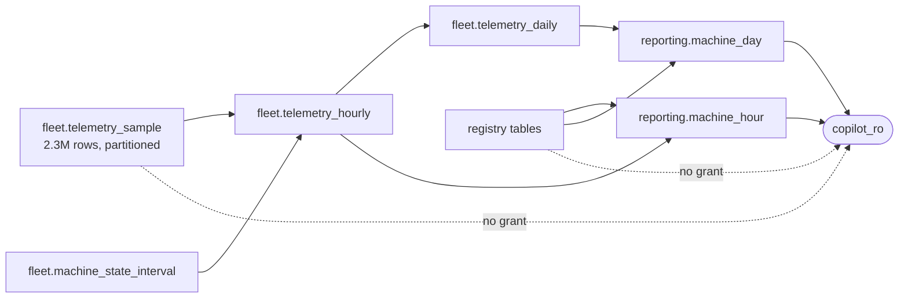

# Data model

Two schemas. `fleet` holds the operational data and the agent cannot see any of
it; `reporting` holds views over the rollups and the registry and is everything
the agent can see. That boundary is enforced by grants, not by convention — see
[the reporting section](#the-reporting-boundary).

The registry is generated from the same `data/catalogue.yaml` as the document
corpus, so a serial quoted in a service report resolves to a machine and a site
named in a handover note has machines standing on it.

## Entity relationship diagram

```mermaid
erDiagram
    machine_type ||--o{ machine_config : "is built as"
    machine_config ||--o{ machine : "configures"
    site ||--o{ machine : "hosts"
    site ||--o{ operator : "employs"
    machine ||--o{ machine_state_interval : "was in state"
    machine ||--o{ telemetry_sample : "reports"
    machine ||--o{ fault_event : "raised"
    machine ||--o{ service_ticket : "is subject of"
    operator ||--o{ service_ticket : "raised"
    error_code ||--o{ fault_event : "identifies"
    error_code ||--o{ error_code_machine_type : "applies to"
    machine_type ||--o{ error_code_machine_type : "can raise"

    machine_type {
        text code PK "SD-50B"
        text family "scrubber_dryer_walk_behind"
        text name_en
        text name_hu
    }
    machine_config {
        text item_number PK "1.512-340.0"
        text machine_type_code FK
        text battery_chemistry "lithium-ion | agm"
        text deck "brush | pad"
        int solution_tank_l "null on sweepers"
        int recovery_tank_l "never less than solution"
        int hopper_l "null on scrubber-dryers"
    }
    site {
        text slug PK
        text name
        text address
        text language "en | hu"
        point centre "must lie inside geofence"
        polygon geofence "(lon, lat) vertices, GiST indexed"
    }
    machine {
        text serial PK "SD50B-2026-10142"
        text item_number FK
        text site_slug FK
        date commissioned_on
    }
    operator {
        int id PK
        text full_name
        text site_slug FK
    }
    error_code {
        text code PK "E-041"
        text title_en
        text title_hu
    }
    error_code_machine_type {
        text code PK_FK
        text machine_type_code PK_FK
    }
    machine_state_interval {
        bigint id PK
        text serial FK
        text state "working | transit | idle_on | off"
        tstzrange period "half-open; no two overlap per serial"
        timestamptz started_at "generated from period"
        timestamptz ended_at "generated from period"
    }
    telemetry_sample {
        text serial PK_FK
        timestamptz ts PK "partition key, monthly"
        real internal_temp_c
        real battery_soc_pct
        real battery_voltage_v
        real battery_temp_c
        float lat
        float lon
        real speed_kmh
    }
    fault_event {
        bigint id PK
        text serial FK
        text code FK
        timestamptz occurred_at
        text doc_id "corpus service report, if one exists"
    }
    service_ticket {
        text id PK "TCK-2026-0001"
        text serial FK
        timestamptz opened_at
        timestamptz closed_at "null iff status is not closed"
        text status "open | in_progress | closed"
        text summary
        int raised_by FK
    }
```

`reporting_as_of` is not shown: it is a single-row table holding the instant
reporting treats as *now*, with no relationships.

## Three decisions the diagram cannot show

**State is intervals, not samples.** `machine_state_interval` stores a
`tstzrange` with an exclusion constraint:

```sql
CONSTRAINT machine_state_no_overlap
    EXCLUDE USING gist (serial WITH =, period WITH &&)
```

"A machine is in exactly one state at any instant" is therefore a property of
the schema rather than of whichever code last wrote to it, and utilisation
becomes range arithmetic. Bounds are half-open on purpose: with an inclusive
upper bound two adjacent intervals would share their boundary instant, the
constraint would reject the pair, and the machine could never change state.
The constraint needs `btree_gist`, because it mixes plain equality on `serial`
with range overlap on `period`.

**Telemetry is range-partitioned by month**, one partition per calendar month of
2026, with no `DEFAULT` partition — a sample dated outside every declared month
is rejected rather than quietly stored. [ADR 0004](adr/0004-telemetry-storage-and-partitioning.md)
records why this is native partitioning rather than a TimescaleDB hypertable.

**Geography is native PostgreSQL, not PostGIS.** A geofence is a `polygon` of
`(lon, lat)` vertices and containment is the built-in `polygon @> point`
operator, GiST-indexed. Distances are metres from `fleet.haversine_m`, because
PostgreSQL's built-in point distance is Euclidean in degrees — not metres, and
wrong by a factor that varies with latitude.

## Rollups

| View | Grain | Holds |
| --- | --- | --- |
| `fleet.telemetry_hourly` | machine × hour | minutes in each state, sensor extremes, charge at the start and end of the hour, metres travelled, samples outside the geofence and off-site |
| `fleet.telemetry_daily` | machine × day | the same, rolled up; temperature averages weighted by sample count |

The hour grid is built from the **state intervals**, not from the samples. A
switched-off machine emits no telemetry, so a sample-derived grid would have no
row at all for those hours and "minutes off" would read as missing rather than
as zero.

Two geofence counts, because they answer different questions. A machine working
at its customer's other site is outside its own fence and is not lost;
`off_site_samples` counts only positions that no site covers at all.

Distance excludes steps more than five minutes apart — a machine switched off in
one place and on in another has not driven between them — and steps under two
metres, which is GPS jitter and would otherwise report a parked machine as
having travelled about a kilometre per shift.

## The reporting boundary



`copilot_ro` holds `USAGE` on `reporting`, `SELECT` on its views, `EXECUTE` on
`reporting.as_of()`, and nothing else. The views keep working because a
PostgreSQL view checks the **owner's** privileges against its base tables, so
they read what the role cannot.

`PUBLIC` is revoked on the `public` schema as part of this. `PUBLIC` is a grant
to every role that will ever exist, so leaving it would let `copilot_ro` read
whatever a later migration happened to create there, with nothing about the
reporting grants looking wrong.

Proven in `tests/fleet/test_database.py`: the role is refused on
`fleet.telemetry_sample`, on every base table, on `INSERT`, and on `CREATE
TABLE`.

## Time

Every reporting query reads `reporting.as_of()` rather than `now()`. The fleet
window is fixed — 90 days ending 2026-09-15, matching the corpus date range — so
`now()` would ask about a week with nothing in it.

It is a `STABLE SECURITY DEFINER` function rather than only a view because the
planner evaluates a `STABLE` function once per statement and can use it as an
index qualifier. Joining the one-row view instead turned the predicate into a
post-join filter: 330 ms and a full scan of the rollup, against 1.8 ms for the
index scan.

## Working with it

```console
$ just up            # postgres
$ just db-migrate    # apply every migration
$ just db-seed       # 40 machines, 90 days, ~2.3M samples (about two minutes)
$ just db-queries    # run the six reference queries as copilot_ro, with timings
```

The seed is idempotent: it truncates and reloads inside one transaction, and the
generator is deterministic, so a second run reproduces the first exactly.

The six reference queries live in `src/fleet_copilot/fleet/queries/`. They are
the specification of what the reporting schema is for — a question that cannot
be answered from these views is a gap in the schema.
